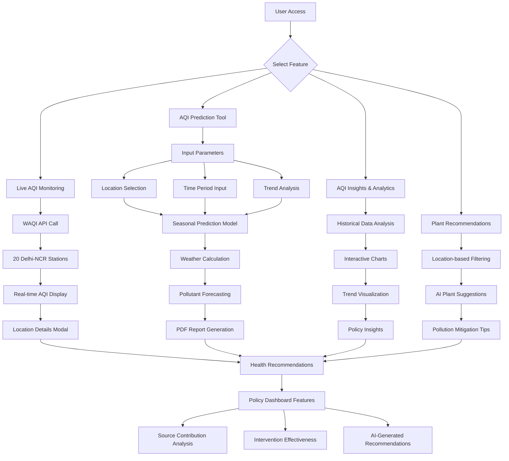
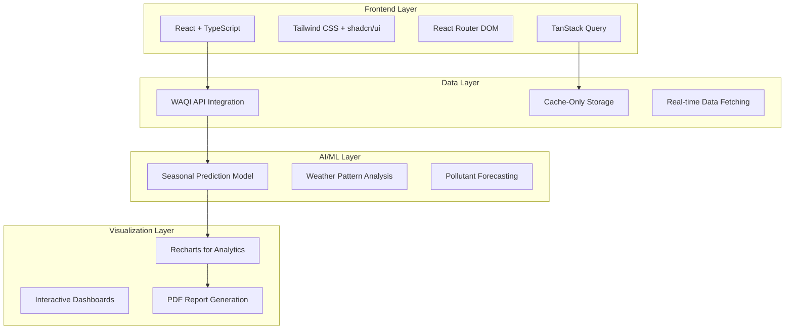
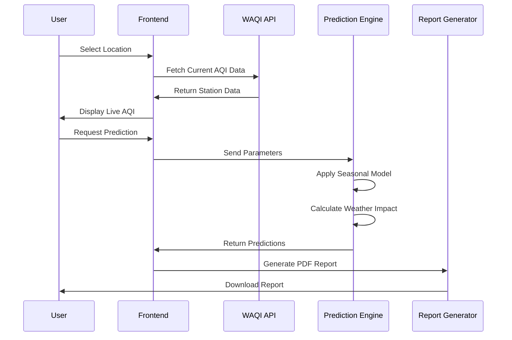

# Delhi-NCR AQI Dashboard - System Architecture & Workflow

## 🎯 Problem Statement
**AI-Driven Pollution Source Identification, Forecasting & Policy Dashboard for Delhi-NCR**

## 🔄 System Flowchart

## 🏗️ Technical Architecture

## 📊 Data Flow

## 🎯 Key Features Implemented

### ✅ Core Requirements
- **Source Identification** - Multi-station monitoring across Delhi-NCR
- **Forecasting** - Seasonal prediction model with weather integration
- **Citizen Dashboard** - Real-time AQI with health recommendations
- **Policy Insights** - Data visualization and trend analysis

### 🚀 Technical Implementation
- **Cache-Only Architecture** - No database dependency
- **Real-time Updates** - Live data refresh from CPCB stations
- **Responsive Design** - Mobile and desktop optimized
- **PDF Generation** - Downloadable reports and insights

## 📍 Monitoring Network
**20 Delhi-NCR Stations Covered**
- Real-time data from WAQI API
- Comprehensive pollution source tracking
- Hyperlocal air quality monitoring